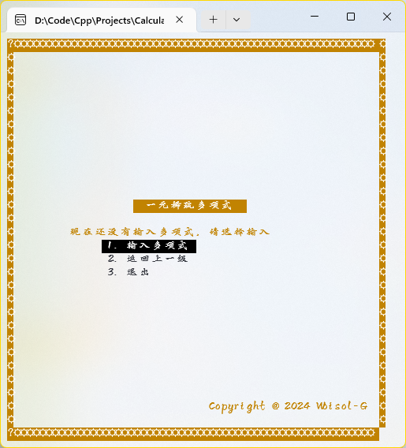
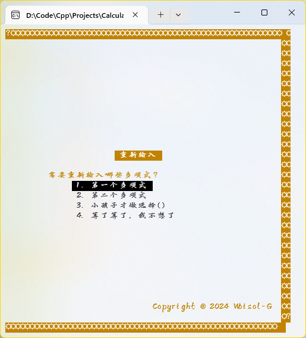

# Project 1
陈震宇 23336051

2024-09-29

## Introduction
本程序使用C++和pdCurses库实现了一个简单的一元稀疏多项式计算器以及表达式求值，用户可以输入多项式或数学表达式，程序将对其进行解析并计算结果。

### TUI界面
本程序使用pdCurses库实现了简单的TUI界面，用户通过键盘进行操作。\
注意由于pdCurses库的特性，UI显示效果在不同的机器上可能有偏差，即使在本机也由于pdCurses对中文适配不佳的问题导致边框绘制存在问题。\
如果需要更好的UI效果请使用项目根目录下的`Calculator_GUI.exe`文件。

>
>
> 主页

>
>
> 多项式计算功能界面

>
>
> 表达式计算功能界面
### 一元稀疏多项式计算器

程序支持多项式的浮点数输入，支持多项式的求值、求导、加减乘运算。

>
>
> 输入界面

> >
>
> 可以显示已输入的最多两个多项式，支持小数输入

>
>
>
> 支持多项式加减乘法，支持求值求导

>
>
>
> 支持非法输入提示

>
>
> 可以重新输入多项式

### 表达式求值
程序支持输入包含加减乘除、乘方、单目减以及括号的表达式，并自动进行计算求值。支持表达式非法提示，但暂不支持小数。
>
>
> 表达式计算求值，支持乘方以及括号

>
>
>
> 支持非法输入提示

## 原理
### TUI界面

本程序使用pdCurses库实现了简单的TUI界面，为用户提供人性化的操作体验。

本人作为前端爱好者对前端有浓厚的兴趣，对React的使用也有一定了解。\
本项目的UI实现使用了组件化的开发方式，且部分变量函数的命名风格参考了React，可能不符合C++的命名规范，都是规范不过领域不同，希望不会被扣掉代码规范的分（祈祷）。\

对pdCurses主要使用了其box()绘制边框, mvprintw()定位并打印文字, attron()设定文字颜色。\
由于本人第一次实际学习TUI的库，对库的使用并不深入，可能没有较好地利用pdCurses的所有特性。
```c++
// **窗口组件代码
```

### 一元稀疏多项式计算器

本程序对于一元稀疏多项式的计算实现采用了`vector<pair<double, double>>`数据结构，其中每个元素代表一个多项式的系数和指数。\
在输入结束后，程序会自动尝试读取输入的数据，进行合法性检测，如果不合法会放弃多项式的输入。\
由于使用了`vector`，因此多项式的加减乘法只需要使用vector遍历各项，并进行相应的运算即可。\
求值和求导功能原理相同。
```c++
// **输入合法性检测部分代码
if (input.empty())
{
	Dialog_Error("输入错误！", "输入为空！");
	return;
}
if ([&]() {
	int n, count = 0;
	double Idouble;
	if (!isdigit(input[0]) || input[0] == '0')
	{
		Dialog_Error("输入错误！", "输入的n非正整数");
		return true;
	}
	stringstream sstream(input);
		sstream >> n;
		while (sstream >> Idouble)
		{
			count++;
		}
	if (count != 2 * n)
	{
		Dialog_Error("输入错误！", "输入数据的数量不正确或含有非法字符！！");return true;
	}
	return false;
	}())return;
```
```c++
// **多项式加法部分代码
Multinomial operator+(const Multinomial& other) const {
	Multinomial res;
	res.multinomialIndicator = multinomialIndicator;
	// td其实降序的话可以再优化一下……
	for (auto p : other.multinomialIndicator)
	{
		auto it = find_if(res.multinomialIndicator.begin(), res.multinomialIndicator.end(), [p](const pair<int, int>& q) {
			return q.second == p.second;
			});
		if (it == res.multinomialIndicator.end())
		{
			res.multinomialIndicator.push_back(p);
		}
		else
		{
			it->first += p.first;
		}
	}
	sort(res.multinomialIndicator.begin(), res.multinomialIndicator.end(), [](const pair<int, int>& p, const pair<int, int>& q) {
		return p.second > q.second;
		});
	return res;
}
```

### 表达式求值

本程序对于表达式的求值采用了栈数据结构`stack<int>`，同时使用`map<char, map<char, bool>>`来存储运算符优先级。\
存储的bool代表了当前运算符的上一个运算符为某个值时是该入栈还是该进行计算。\
计算式，程序一次读取每个字符，如果为数字则压入数字栈，如果为运算符判断运算符优先级后判断是否计算上一个运算子\
<!-- td 更新一下去掉注释后的代码 -->
```c++
int calculate() {
	char input;
	stringstream sstream(expression);
	while (!operations.empty())operations.pop();
	while (!opnums.empty())opnums.pop();
	while (sstream.get(input))
	{
		if (isdigit(input))
		{
			// sstream.putback(c);
			// // ！原来有这个函数……
			// int num;
			// sstream >> num;
			// opnums.push(num);
			// !麻了这样始终push的0……搞不懂……
			int num = input - '0';
			while (isdigit(input = sstream.get()))
			{
				num = num * 10 + (input - '0');
			}
			sstream.putback(input);
			if (opnums.size() == 0 && operations.size() == 1)
			{
				if (operations.top() == '-')
				{
					operations.pop();
					opnums.push(num * -1);
				}
				else if (operations.top() == '+') opnums.push(num);
				// dtd 错误处理
				else
				{
					Dialog_Error("表达式错误！", "表达式中出现多余的符号");
					return -1;
				}
				continue;
			}
			// !然后意外发现这样以后 -1 + 2 * 2也处理好了……
			opnums.push(num);
		}
		// !FT补全几次都补全不对……
		// ~~下面参考了https://blog.csdn.net/qq_41404557/article/details/115207653
		// !woq https://blog.csdn.net/PengHao666999/article/details/135899403的有图例代码也更简单！
		else if (input == '(')
		{
			// if (operations.empty())operations.push(c);continue;
			// while (!operations.empty() && priority_map[operations.top()][c] && priority_map[operations.top()][c] <= priority_map[operations.top()][c])
			// {
			// 	int num2 = opnums.top();
			// 	opnums.pop();
			// 	int num1 = opnums.top();
			// 	opnums.pop();
			// 	char op = operations.top();
			// 	operations.pop();
			// 	opnums.push(calSwitch(num1, op, num2));
			// }
			// operations.push(c);
			operations.push(input);
		}
		else if (input == ')')
		{
			while (operations.top() != '(')calc();
			operations.pop();
		}
		else
		{
			while (!operations.empty() && operations.top() != '(' && priority_map[operations.top()][input])
				// !注意这里就是比较栈顶元素是否比当前的大……
				if (!calc())return -1;
			operations.push(input);
		}
		// lastOp = c;
	}
	while (!operations.empty())
	{
		if (operations.top() == '(' || operations.top() == ')')
		{
			// dtd分.h后弹出错误Dialog
			Dialog_Error("表达式错误！", "表达式中存在不匹配的括号");
			return -1;
		}
		// if (opnums.size() != operations.size() + 1)
		// {
		// 	return -1;
		// }
		// !中途就要计算的……不能在这里检查……
		// if (opnums.size() < 2)
		// {
		// 	if (operations.top() == '+')
		// 		return opnums.top();
		// 	else if (operations.top() == '-')
		// 		return opnums.top() * -1;
		// 	else
		// 		return -1;
		// }
		int num2 = opnums.top();
		opnums.pop();
		int num1 = opnums.top();
		opnums.pop();
		char op = operations.top();
		operations.pop();
		opnums.push(calSwitch(num1, op, num2));
	}
	return opnums.top();
}
```
## 其它

本程序由本人独立完成，项目使用了git跟踪项目进度，可以在git中查看项目开发过程。\
作为本人第一个pdCurses项目，本项目也同时发布在了Github上，希望可以得到您的star和指正。

~~另外本项目花了本人大量时间，可以以此为免死金牌在课堂抽查的时候不抽我嘛~~\
当然要抽我也没问题不想上台演示而已;)